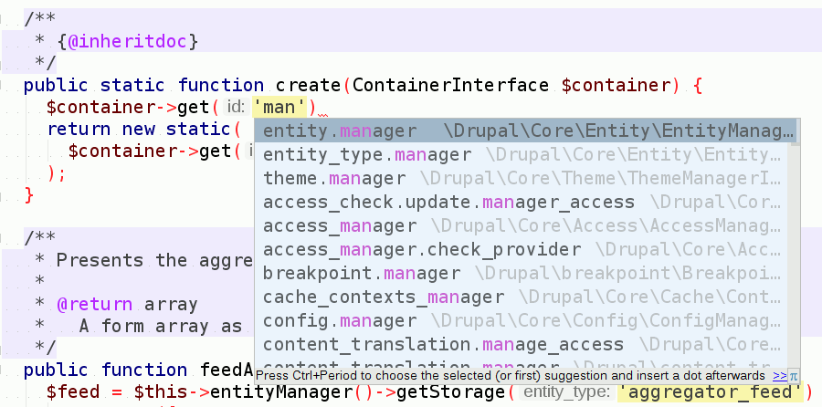
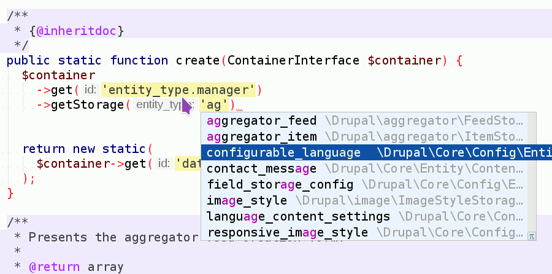
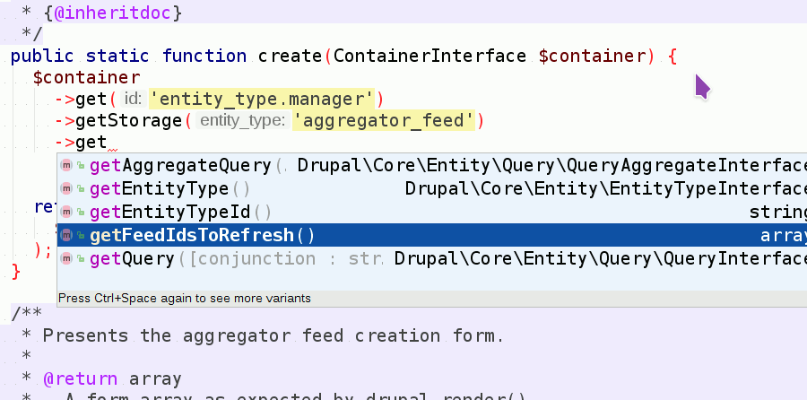

# Drush - IDE Helper

The `drush ide-helper:phpstorm-meta` command generates
[PhpStorm Advanced Metadata](https://confluence.jetbrains.com/display/PhpStorm/PhpStorm+Advanced+Metadata)
files from a running Drupal site.

## Install

1. Run `composer config 'repositories.drupal-8' 'composer' 'https://packages.drupal.org/8'`
1. Run `composer require --dev drupal/ide_helper`

## Usage

`drush ide-helper:phpstorm-meta`

## Screenshots

Autocomplete for service names

------------

Autocomplete for entity type identifiers

------------

Autocomplete for the methods of a service instance

